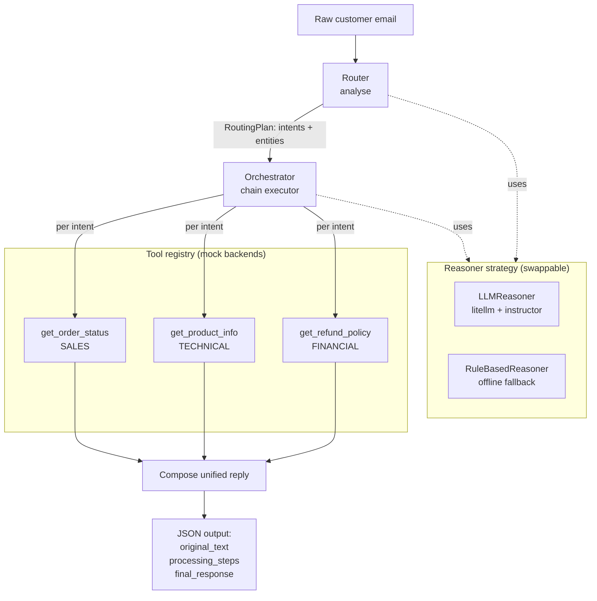

# Intelligent Customer-Support Email Assistant

An LLM-orchestrated pipeline that reads a long, multi-intent customer
support email, figures out which departments it touches, gathers the
data each part needs from internal (mock) systems, and writes back a
single, coherent reply.

## Contributors

- Amirhossein Entezari — amir@entezari.org — https://github.com/Amir-Entezari
- Amirali Amini — amini.core@gmail.com — https://github.com/Amir-Ali-Amini

It is built around the **AI Router + chaining** pattern required by the
assignment: an orchestrator analyses the email, decides what steps are
needed, runs a chain of tool calls, and synthesises the result.

```
raw email  ─►  Router (analyse)  ─►  Orchestrator (run tool chain)  ─►  Reasoner (compose)  ─►  JSON
```

---

## Highlights

- **Built on proven libraries** rather than hand-rolled plumbing:
  - **litellm** — one interface over 100+ LLM providers (OpenAI,
    Anthropic, Groq, Gemini, local Ollama / vLLM / LM Studio). Switching
    provider is a config change, not a code change.
  - **instructor** — turns a Pydantic model into the LLM's
    `response_model`, so the routing step returns a validated
    `RoutingPlan` and retries automatically on malformed output.
  - **pydantic** — typed, validated data models used both internally and
    as the LLM output schema.
  - **python-dotenv** — configuration from a local `.env`.
- **Two interchangeable reasoning strategies** behind one interface
  (Strategy pattern): the LLM reasoner above, and an offline
  `RuleBasedReasoner` so the system still runs and is testable with no
  API key or network.
- **Exact output contract**: every email yields JSON with
  `original_text`, `processing_steps`, and `final_response`.
- **Tested**: 18 `unittest` cases covering tools, routing, entity
  extraction, and the end-to-end contract.

---

## High-level architecture



**The chain.** The output of each stage is the input to the next:
`analyse` produces a `RoutingPlan` → the orchestrator turns each intent
into a tool call and collects the results → those results are the input
to `compose`, which writes the final email.

---

## How it works, step by step

1. **Analyse / Route.** The `Router` asks the active `Reasoner` to read
   the email and return a `RoutingPlan` — a list of `Intent`s, each
   tagged with a `Department` and any extracted entities (`order_id`,
   `product_name`). With the LLM strategy, `instructor` fills and
   validates this Pydantic model directly. The router then drops any
   intent for which no tool exists.
2. **Execute the tool chain.** For each intent the `Orchestrator` looks
   up the matching tool in the `ToolRegistry`, supplies the arguments the
   tool's schema requires, calls it, and records the step. Missing
   required arguments are logged rather than guessed.
3. **Compose.** All gathered facts are handed back to the `Reasoner`,
   which writes one unified, appropriately-toned reply.
4. **Return** the `TicketResult` as the required JSON.

---

## Project structure

```
intelligent-support-assistant/
├── main.py                       # CLI entry point
├── src/support_assistant/
│   ├── schemas.py                # Pydantic models (Intent, RoutingPlan, ...)
│   ├── config.py                 # Settings + factory (chooses the reasoner)
│   ├── router.py                 # the AI Router
│   ├── orchestrator.py           # the chaining pipeline
│   ├── tools/
│   │   ├── __init__.py           # Tool + ToolRegistry (Registry pattern)
│   │   └── mock_apis.py          # the 3 required mock backend functions
│   └── llm/
│       ├── base.py               # Reasoner interface (Strategy pattern)
│       ├── __init__.py           # LLMReasoner (litellm + instructor)
│       ├── rule_based.py         # offline RuleBasedReasoner
│       └── prompts.py            # LLM prompt templates
├── examples/sample_emails.py
├── tests/                        # unittest suite
├── requirements.txt
└── .env.example
```

---

## Setup

```bash
python -m venv .venv && source .venv/bin/activate   # optional
pip install -r requirements.txt
```

The system runs **without any API key** out of the box (offline
reasoner). To use a real model, copy `.env.example` to `.env` and set at
least `SUPPORT_LLM_MODEL`.

---

## Running it

```bash
# Inline email
python main.py --text "Where is order #12345, and what's your refund policy?"

# From a file / stdin
python main.py --file customer_email.txt
cat customer_email.txt | python main.py

# Run all bundled sample emails
python main.py --demo

# Include the internal plan + tool results
python main.py --demo --debug
```

### Choosing a provider (LLM mode)

Set these in `.env` (or the environment). `SUPPORT_LLM_MODEL` is a
litellm model string:

| Provider | `SUPPORT_LLM_MODEL` | also set |
|---|---|---|
| OpenAI | `gpt-4o-mini` | `SUPPORT_LLM_API_KEY` (or `OPENAI_API_KEY`) |
| Anthropic | `anthropic/claude-3-5-haiku-latest` | `ANTHROPIC_API_KEY` |
| Groq | `groq/llama-3.1-8b-instant` | `GROQ_API_KEY` |
| Local Ollama | `ollama/llama3.1` | — |
| OpenAI-compatible / proxy | `openai/<name>` | `SUPPORT_LLM_API_BASE`, `SUPPORT_LLM_API_KEY` |

```bash
python main.py --demo --verbose   # logs which strategy/model is used
```

---

## Running the tests

```bash
python -m unittest discover -s tests -v
```

The tests force the **offline** reasoner, so they need no API key or
network.

---

## Design patterns and technology choices

| Pattern | Where | Why |
|---|---|---|
| **Strategy** | `Reasoner` → `LLMReasoner` / `RuleBasedReasoner` | Swap the "brain" (real LLM vs. offline heuristics) without touching orchestration; keeps the system runnable and testable offline. |
| **Registry** | `ToolRegistry` | The orchestrator dispatches tools by name and never hard-codes which function to call; adding a department is a one-line registration. |
| **Factory** | `build_reasoner` / `build_orchestrator` | Centralises wiring and the LLM-vs-offline decision in one config-driven place. |
| **Pipeline / Chain** | `SupportOrchestrator.process` | Implements the required chaining: analyse → execute → compose, each stage feeding the next. |
| **Adapter** | `litellm` + `instructor` | Adapt any of 100+ providers to one interface, and adapt raw model output into validated Pydantic objects. |

**Why these libraries.** `litellm` + `instructor` are the standard,
lightweight way to get provider-agnostic, schema-validated LLM output —
the structured-output and multi-provider plumbing that would otherwise be
error-prone to write by hand. The router/orchestrator logic is kept
explicit and framework-free so the *architecture* (the graded part)
stays readable and ours, rather than disappearing into a large agent
framework.

---

## Honest limitations

- The three backend functions return **mock data**, exactly as the brief
  permits; there is no real database.
- The **offline** reasoner uses keyword/regex heuristics. It handles the
  sample cases well but is not meant to match an LLM's understanding —
  it exists so the system always runs. For production routing, configure
  the LLM strategy.
- Translation of non-English emails is detected and logged as a planned
  step but not implemented in the offline path.
